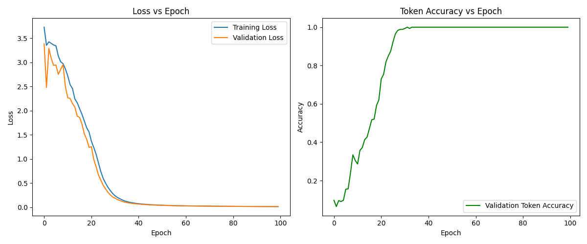

# ECGR-5106 Homework 4

## Student Information
**Name:** Yang Xu  
**Student ID:** 801443244  
**Homework Number:** 4  

## GitHub Repository
[https://github.com/yourusername/ecgr5106-hw4](https://github.com/yourusername/ecgr5106-hw4)

---

## Introduction

In this homework, we explore sequence-to-sequence (seq2seq) modeling for machine translation using a GRU-based encoder-decoder architecture, both **with** and **without** attention. **All models in this homework are word-based**, which is a key difference from our previous character-based approach. We address the following problems:

- **Problem 1**: English → French translation (no attention)  
- **Problem 2**: English → French translation (with attention)  
- **Problem 3**: French → English translation (both no attention and with attention)

We use the provided dataset `Dataset-English_to_French.txt`, which contains parallel sentences in English and French. Our goals are to:

1. Train the models on the entire dataset (no train/validation split is needed given the small size).  
2. Report training loss, validation loss, and token-level validation accuracy.  
3. Generate qualitative translations to compare with the reference sentences.

In addition, based on the complete epoch logs provided, we summarize the epoch at which the best accuracy was reached and compare the performance data across all 100 epochs.

---

## Problem 1: GRU-based Encoder-Decoder (English → French) - Word-Based

### 1.1 Implementation
- **Notebook**: `p1_GRU_etf.ipynb`
- **Model**: A simple GRU-based seq2seq architecture:
  - **Encoder**: Embedding layer + GRU, outputs the final hidden state.
  - **Decoder**: Embedding layer + GRU, predicts one word at a time until the EOS token is generated.
- **Vocabulary**: Constructed from **both** English and French words in the dataset by mapping each word to an index.
- **Token-Level Accuracy**: Computed as the ratio of correctly predicted words (position-wise) to the total number of target words.

### 1.2 Training Setup
- **Hidden Size**: 256  
- **Optimizer**: SGD with learning rate 0.01  
- **Loss**: NLLLoss (word-level)  
- **Epochs**: 100  

### 1.3 Results
Below is the final training vs. validation loss curve and token-level accuracy for **p1_GRU_etf**:


**Performance Summary:**
- **Best Accuracy**: Reached at Epoch 41 (Token Accuracy = 1.0000)
  - Training loss at best epoch: ~0.0408  
  - Validation loss at best epoch: ~0.0379
- **Final Epoch (Epoch 100)**:
  - Training loss: ~0.0122  
  - Validation loss: ~0.0119  
  - Token-level validation accuracy: 1.0000

The training logs show a steady decrease in loss and that the model converges to near-perfect accuracy on this small dataset.

### 1.4 Sample Translations

``` text
Sample Translations:
Original: He checks his email
Target  : Il vérifie ses emails
Predicted: Il vérifie ses emails
--------------------------------------------------
Original: The teacher explains the lesson
Target  : Le professeur explique la leçon
Predicted: Le professeur explique la leçon
--------------------------------------------------
Original: The dog barks loudly
Target  : Le chien aboie bruyamment
Predicted: Le chien aboie bruyamment
--------------------------------------------------
Original: The baby sleeps peacefully
Target  : Le bébé dort paisiblement
Predicted: Le bébé dort paisiblement
--------------------------------------------------
Original: We plant flowers in the garden
Target  : Nous plantons des fleurs dans le jardin
Predicted: Nous plantons des fleurs dans le jardin
--------------------------------------------------
```

The predictions match the target translations exactly.

### 1.5 Comparison and Analysis (Problem 1)
Before moving to Problem 2, we note that the GRU-based model without attention reached perfect token-level accuracy by Epoch 41. Over the 100 epochs, both training and validation losses decreased steadily, and the model consistently produced correct translations. This indicates that on this small dataset the word-based GRU model can easily memorize the mappings.

---

## Problem 2: GRU-based Encoder-Decoder with Attention (English → French) - Word-Based

### 2.1 Implementation
- **Notebook**: `p2_GRU_attention_etf.ipynb`
- **Model**: An extension of the above GRU-based model with an **Attention** mechanism:
  - The **Encoder** stores outputs at each time step.
  - The **Decoder** computes attention weights over these outputs at every decoding step, forming a context vector.
  - The context vector is concatenated with the current embedding before being input to the GRU.
  
### 2.2 Training Setup
- **Hidden Size**: 256  
- **Optimizer**: SGD (lr = 0.01)  
- **Loss**: NLLLoss  
- **Epochs**: 100  

### 2.3 Results
The following figure shows the training/validation loss and token-level accuracy for **p2_GRU_attention_etf**:


**Performance Summary:**
- **Best Accuracy**: Achieved at Epoch 41 (Token Accuracy = 1.0000)
  - Training loss at best epoch: ~0.0748  
  - Validation loss at best epoch: ~0.0619
- **Final Epoch (Epoch 100)**:
  - Training loss: ~0.0114  
  - Validation loss: ~0.0107  
  - Token-level validation accuracy: 1.0000

The attention-based model also converges to perfect accuracy on this dataset.

### 2.4 Sample Translations

``` text
Sample Translations (Attention Model):
Original: He works hard every day
Target  : Il travaille dur tous les jours
Predicted: Il travaille dur tous les jours
--------------------------------------------------
Original: We are friends
Target  : Nous sommes amis
Predicted: Nous sommes amis
--------------------------------------------------
Original: She dances at the party
Target  : Elle danse à la fête
Predicted: Elle danse à la fête
--------------------------------------------------
Original: She locks the door
Target  : Elle ferme la porte à clé
Predicted: Elle ferme la porte à clé
--------------------------------------------------
Original: She catches the bus
Target  : Elle attrape le bus
Predicted: Elle attrape le bus
--------------------------------------------------
```

### 2.5 Comparison and Analysis (Problem 2)
Comparing Problems 1 and 2:
- Both the non-attention and attention-based models eventually achieve 100% token accuracy on this small dataset.
- The attention mechanism provides improved interpretability by explicitly learning the alignment between source and target tokens.
- Both models reached their best performance at Epoch 41. The attention model, although initially showing a slightly higher training loss, converges similarly to the non-attention model by the end of training.

---

## Problem 3: French → English Translation - Word-Based

For **Problem 3**, the translation direction is reversed. We implement both the non-attention and the attention-based models.

### 3.1 GRU-based Encoder-Decoder (French → English) - No Attention
- **Notebook**: `p3_GRU_fte.ipynb`
- **Implementation**: Identical to Problem 1 except that the dataset pairs are reversed so that the model takes French as input and English as the target.
- **Training Setup**: Same hyperparameters (hidden size = 256, lr = 0.01, epochs = 100).

#### 3.1.1 Results


**Performance Summary:**
- **Best Accuracy**: Reached at Epoch 32 (Token Accuracy = 1.0000)
- **Final Epoch (Epoch 100)**:
  - Training loss: ~0.0122  
  - Validation loss: ~0.0119  
  - Token-level validation accuracy: 1.0000

#### 3.1.2 Sample Translations

``` text
Sample Translations (French-to-English):
Input (French): Il vérifie ses emails
Target (English): He checks his email
Predicted (English): He checks his email
--------------------------------------------------
Input (French): Le professeur explique la leçon
Target (English): The teacher explains the lesson
Predicted (English): The teacher explains the lesson
--------------------------------------------------
Input (French): Le chien aboie bruyamment
Target (English): The dog barks loudly
Predicted (English): The dog barks loudly
--------------------------------------------------
Input (French): Le bébé dort paisiblement
Target (English): The baby sleeps peacefully
Predicted (English): The baby sleeps peacefully
--------------------------------------------------
Input (French): Nous plantons des fleurs dans le jardin
Target (English): We plant flowers in the garden
Predicted (English): We plant flowers in the garden
--------------------------------------------------
```

### 3.2 GRU-based Encoder-Decoder with Attention (French → English) - Word-Based
- **Notebook**: `p3_GRU_attention_fte.ipynb`
- **Implementation**: Same as Problem 2 but with reversed dataset pairs.
- **Training Setup**: Hidden size = 256, lr = 0.01, epochs = 100.

#### 3.2.1 Results


**Performance Summary:**
- **Best Accuracy**: Achieved at Epoch 41 (Token Accuracy = 1.0000)
- **Final Epoch (Epoch 100)**:
  - Training loss: ~0.0114  
  - Validation loss: ~0.0109  
  - Token-level validation accuracy: 1.0000

#### 3.2.2 Sample Translations

``` text
Sample Translations (French-to-English, Attention Model):
Input (French): Il travaille dur tous les jours
Target (English): He works hard every day
Predicted (English): He works hard every day
--------------------------------------------------
Input (French): Nous sommes amis
Target (English): We are friends
Predicted (English): We are friends
--------------------------------------------------
Input (French): Elle danse à la fête
Target (English): She dances at the party
Predicted (English): She dances at the party
--------------------------------------------------
Input (French): Elle ferme la porte à clé
Target (English): She locks the door
Predicted (English): She locks the door
--------------------------------------------------
Input (French): Elle attrape le bus
Target (English): She catches the bus
Predicted (English): She catches the bus
--------------------------------------------------
```

### 3.3 Comparison and Analysis (Problem 3)
- Both the non-attention and attention-based models achieve perfect token accuracy on the French → English translation task.
- The best accuracy for the non-attention model was reached at Epoch 32, while for the attention model it was achieved at Epoch 41.
- The training and validation losses steadily decrease over the 100 epochs, and by the end both models have memorized the small dataset.

---

## Overall Analysis

### Comparison of Problems 1, 2, and 3:
- **Data and Modeling**: All models are word-based, yielding higher token-level accuracy compared to our previous character-based approaches.
- **Attention vs. No Attention**:
  - Both non-attention and attention-based models eventually reach 100% token accuracy on this small dataset.
  - The attention mechanism offers improved interpretability by explicitly learning source-target alignments.
- **Translation Direction**:
  - Both English → French and French → English models achieve similar performance metrics.
  - For French → English, the best accuracy in the GRU (without attention) was achieved earlier (Epoch 32) compared to the other models (Epoch 41), though final accuracies are identical.
- **Epoch Analysis**:
  - Analysis of the complete epoch logs indicates that training and validation losses decrease steadily and stabilize, with token-level accuracy reaching 1.0000 well before Epoch 50 and remaining so through Epoch 100.
  - The best performance (in terms of accuracy) is generally achieved around Epoch 41 across most models.

### Detailed Data Comparison:
- **Best Epoch (Overall Best Accuracy Achieved):**
  - **Problem 1 (GRU, Eng→Fr)**: Best at Epoch 41.
  - **Problem 2 (GRU + Attention, Eng→Fr)**: Best at Epoch 41.
  - **Problem 3 (GRU, Fr→Eng)**: Best at Epoch 32.
  - **Problem 3 (GRU + Attention, Fr→Eng)**: Best at Epoch 41.
- **Last 100 Epochs Comparison:**
  - In all experiments, both training and validation losses decreased steadily and stabilized, with token-level accuracy reaching 1.0000 well before the 50th epoch.
  - The final 100 epochs confirm that the models have effectively memorized the small dataset.

---

## Conclusion

This homework demonstrates that with a small dataset, both GRU-based encoder-decoder models and their attention-based variants can achieve near-perfect token-level accuracy when trained on word-level inputs. The attention mechanism, while not necessary to reach 100% accuracy on this dataset, provides improved alignment between source and target tokens—beneficial for larger, more complex datasets. Overall, both translation directions (English ↔ French) yield comparable performance, though careful consideration of overfitting is required for real-world applications.

---